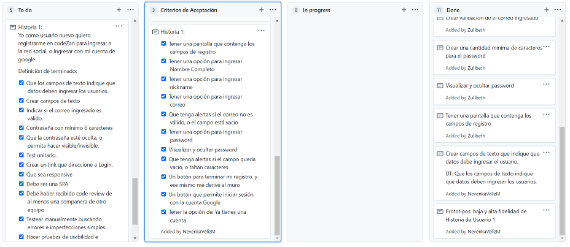
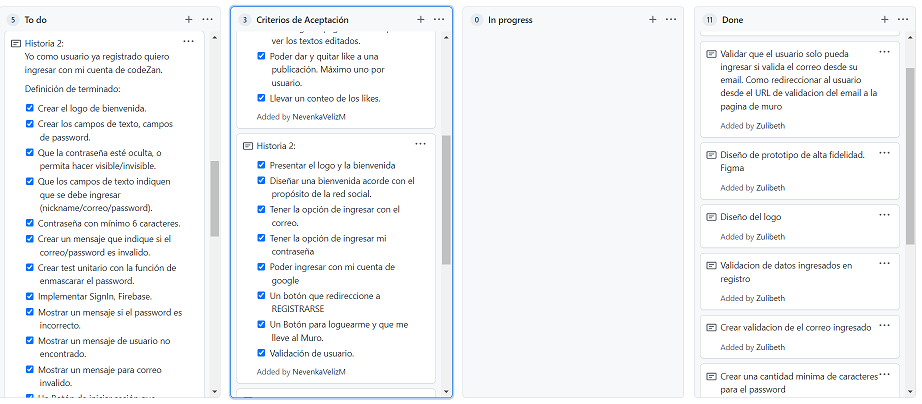
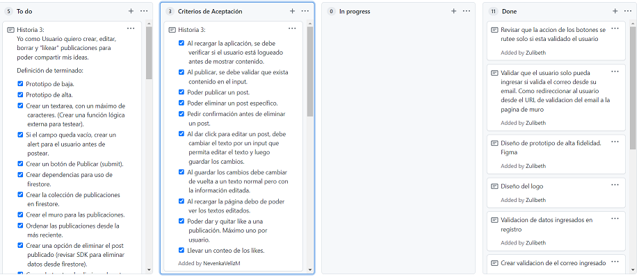
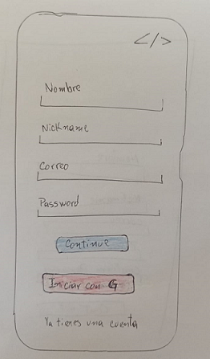
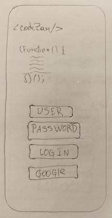
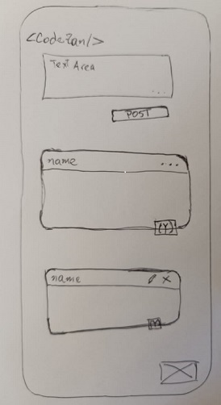
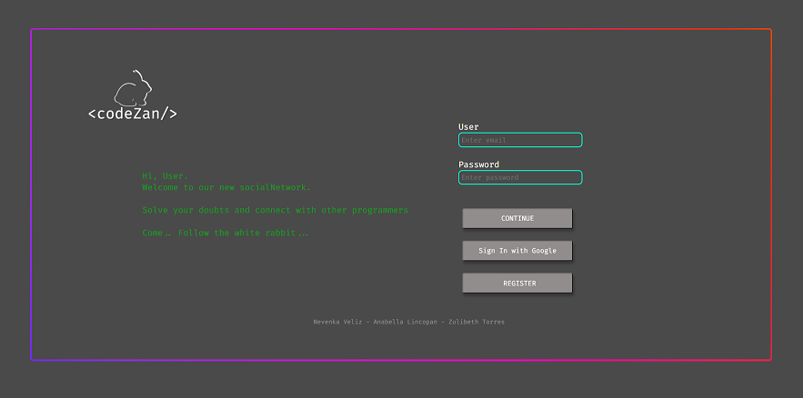
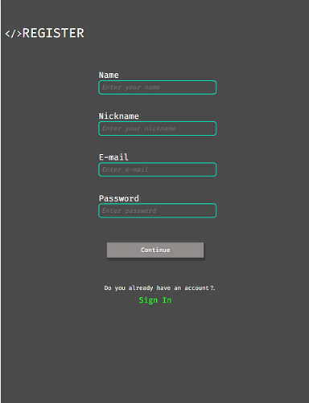
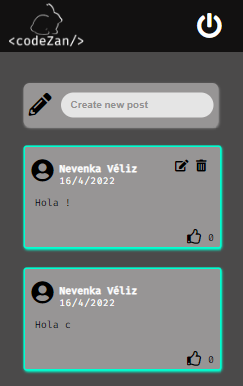

# Social Network: codeZan 

## Índice

* [1. Resumen del Proyecto](#1-Resumen-del-Proyecto)
* [2. Realización del Proyecto](#2-Realización-del-Proyecto)
* [2.1 Investigacion de Usuario](#2.1-Investigación-de-Usuario)
* [2.2 Historias de Usuario](#2.2-Historias-de-Usuario)
* [2.3 Prototipos](#2.3-Prototipos)
* [2.4 Tests de Usabilidad](#2.4-Tests-de-Usabilidad)
* [2.5 Despliegue gitHub pages](#2.5-Despliegue-gitHub-pages)

## 1. Resumen del proyecto

CodeZan es una red social orientada a personajes que trabajan como programadores web de forma independiente o dependiente. En base a nuestra investigación, logramos detectar que existe una falta de redes sociales que permitan una interacción fluida entre personas que se desenvuelven en el mundo de la programación, por lo que quisimos crear esta plataforma que permite compartir ideas y dudas con el resto de programadores. Para esto solo debes registrarte o ingresar con tu cuenta de google y podrás crear editar y eliminar posts, además de poder dar like a las publicaciones.

## 2. Realización del Proyecto

### 2.1 Investigación de Usuario

Con el fin de determinar a nuestro público objetivo realizamos un formulario de preguntas con alternativas, para difundirlo posteriormente en grupos de personas que trabajan en programación. En base a estos resultados, definimos el siguiente perfil de usuario:

* Es programadora/programador
* Tiene entre 25 y 31 años
* Trabaja como freelance o es trabajador dependiente
* Ha tenido redes de ayuda con amigos, familiares y foros, pero no tiene una red social que lo acompañe durante su carrera, o en su día a día.

### 2.2 Historias de Usuario

Estas historias de usuario las organizamos de forma colaborativa mediante Github Projects, distribuyendo las tareas según su estado en distintas columnas.

### 2.3 Prototipos 

### 2.4 Tests de Usabilidad 

Para verificar que nuestra aplicacion tuviera los adecuados criterios de diseño, realizamos tests de usabilidad presenciales en los cuales se nos dió feedback en relación a funciones, mensajes, o contrastes que nos ayudaron a corregir e iterar en nuestro codigo. Ayudandonos a mejorar el mismo despues de cada instancia.

### 2.5 Despliegue GitHub pages
<a href="https://https://nevenkavelizm.github.io/SCL019-social-network/">codeZan👨‍💻</a>.

